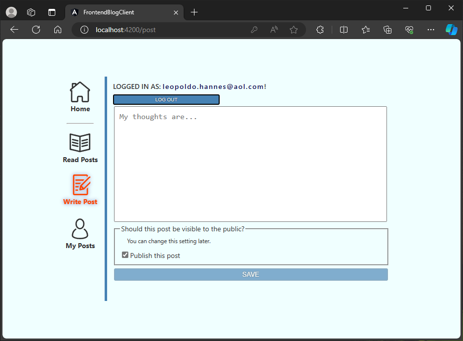

# BlogPortal
 Microservice architecture <u>junior</u> demo project in Spring with Angular frontend running in Docker containers.

 

This application models a full-stack webservice where you can write and share notes or posts with other registered users.

## Getting Started: Running The Application

> **_PRE-REQUISITES:_** Make sure you have [Docker](https://docs.docker.com/get-docker/) installed and running on your computer.

With Docker Engine running, you can run the below commands in the project root folder to start the application.
```powershell
docker-compose up
```
And that's it. Docker-Compose will build all applications into Docker images and start the containers in dependency order. Once everything is fired up, you should be able to try out either the frontend or the backend services directly. 

The following ports will be open:
```
Frontend    :   http://localhost:4200
Backend Gateway :   http://localhost:8080
Zipkin Tracer   :   http://localhost:9411
Spring Eureka(Discovery)    :   http://localhost:8700
Mongo-Express(PostsDB)  :   http://localhost:8081
```
Other ports are only available for internal microservice communication in Docker networks.

There will be demo data in the databases.
To test application features, you can register your own account; or using the password 'qweR42!' you can authenticate with the demo accounts listed in ./build/database/bloguserdb/schema.sql file.

## Technical Overview

This project was made to perform a simple CRUD functionality. However, this time not as a monolith, but with microservice architecture solutions provided by Spring Boot.

Java and framework versions:
- Java 17
- Spring Boot 3.2.3
- Angular 16.2.1

Main Spring Boot dependencies used throughout the project:
- Spring Web
- Spring Actuator
- Spring Cloud Config
- Spring Cloud Gateway
- Spring Cloud Discovery Eureka
- OpenFeign
- Spring Data MongoDB
- Spring Data JPA
- Java JWT
- OpenAPI WebMVC UI (SwaggerUI/API-Docs)
- Zipkin Reporter
- Lombok
- JUnit
- Mockito
- MockMVC
- Hamcrest Matchers

## UI Overview

On the UI, first of all, you can register a new account:


Then, after logging in, you can read the public posts:


Or write a new post:



Or else, check your posts, both public and private ones. Here you can also change the visibility or delete posts:


## Contact

I am always open to learning and improving my code. Any feedback is appreciated.

[LinkedIn](https://www.linkedin.com/in/d%C3%A1vid-remetei-22aa7497/)